# Рисунки к главе 3 — программный стек

> Формат: Mermaid. Экспорт в PNG/SVG: [mermaid.live](https://mermaid.live) или расширение _Markdown Preview Mermaid Support_ в VS Code / Cursor.

---

## Рисунок 3.1 — Pipeline сборки Vite (п. 3.1)

**Подпись:** Схема процесса сборки клиентского приложения: исходные файлы Vue/TypeScript обрабатываются Vite и преобразуются в статический бандл `dist` для развёртывания

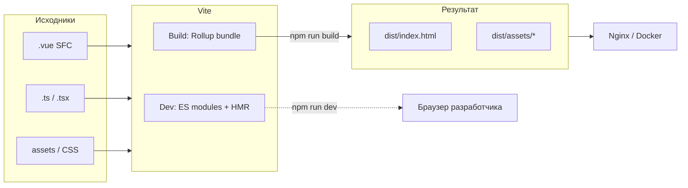

---

## Рисунок 3.2 — Composition API и композиция UI (п. 3.2)

**Подпись:** Иерархическая композиция интерфейса платформы: страницы агрегируют виджеты, виджеты — features и entity-компоненты

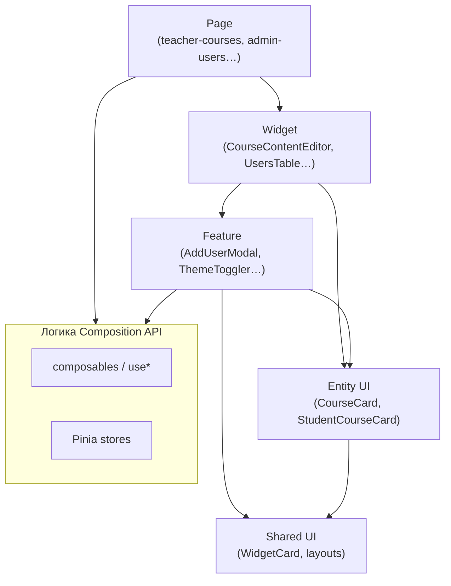

---

## Рисунок 3.3 — Поток типизации данных TypeScript (п. 3.3)

**Подпись:** Цепочка преобразования данных от ответа API к типизированным props компонента пользовательского интерфейса

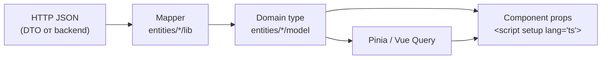

---

## Рисунок 3.4 — Разделение client state и server state (п. 3.4, 3.8)

**Подпись:** Разделение клиентского состояния (Pinia) и серверного состояния (TanStack Vue Query) в архитектуре приложения

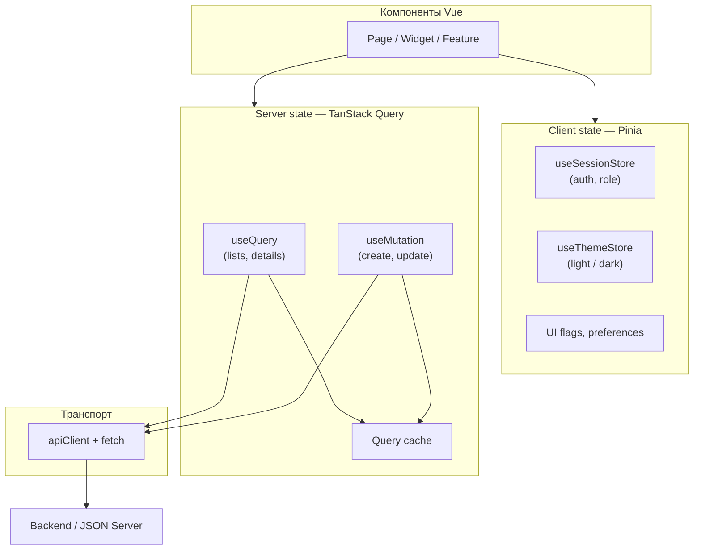

---

## Рисунок 3.5 — Дерево маршрутов Vue Router (п. 3.5)

**Подпись:** Дерево маршрутов клиентского приложения платформы обучения: корневые порталы `/admin`, `/teacher` и `/student` с вложенными маршрутами

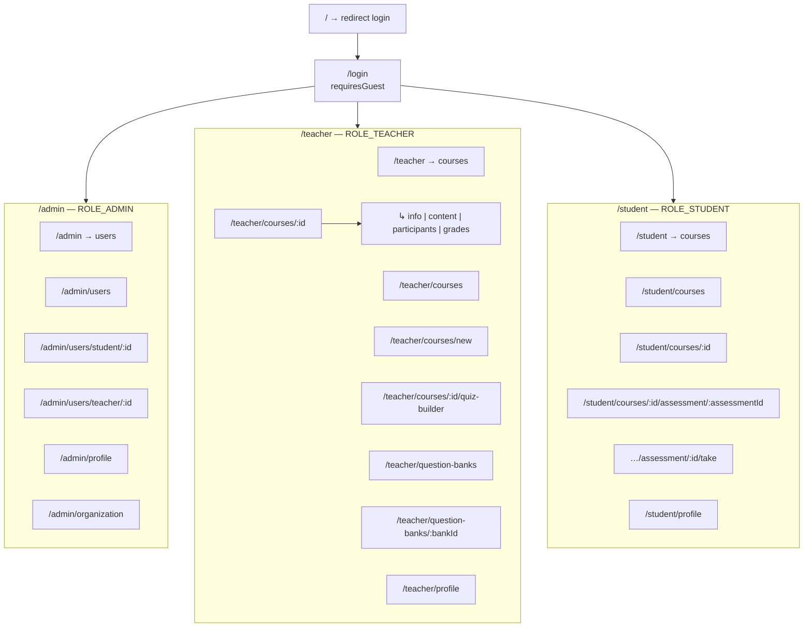

---

## Рисунок 3.6 — Алгоритм navigation guard (п. 3.5)

**Подпись:** Блок-схема алгоритма глобального navigation guard Vue Router: проверка авторизации, гостевых страниц и ролевого доступа

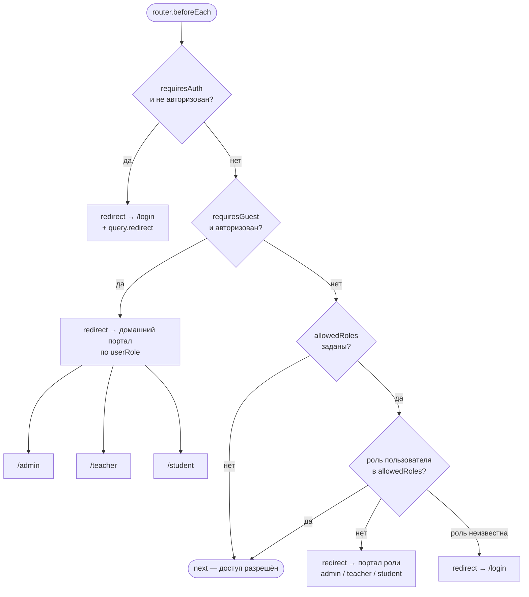

---

## Рисунок 3.7 — Интеграция PrimeVue в приложение (п. 3.6)

**Подпись:** Схема подключения библиотеки PrimeVue: глобальная регистрация, тема Aura и design tokens приложения

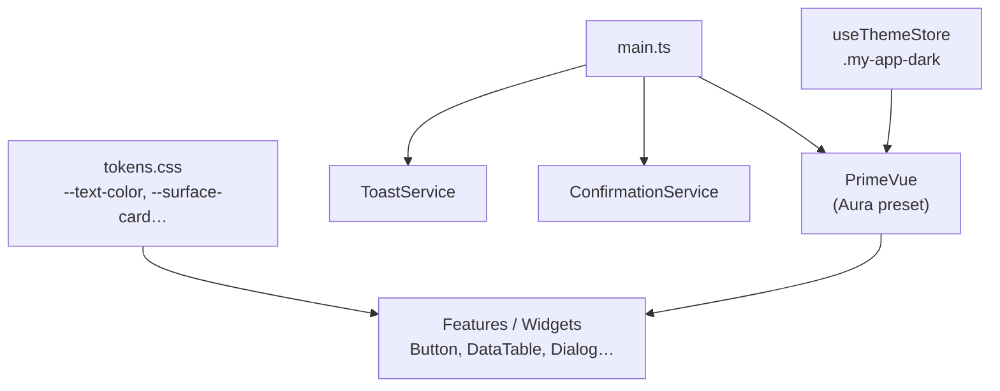

---

## Рисунок 3.8 — Локализация Vue I18n (п. 3.7)

**Подпись:** Схема работы Vue I18n: файлы локалей, переключение языка и синхронизация с компонентами PrimeVue

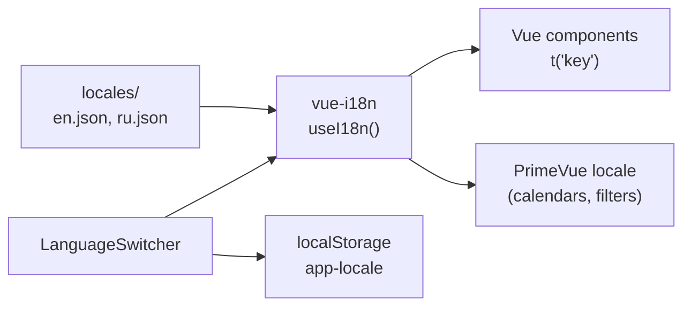

---

## Рисунок 3.9 — Жизненный цикл запроса TanStack Vue Query (п. 3.8)

**Подпись:** Жизненный цикл серверного запроса в TanStack Vue Query: загрузка, кэширование, устаревание и повторный запрос

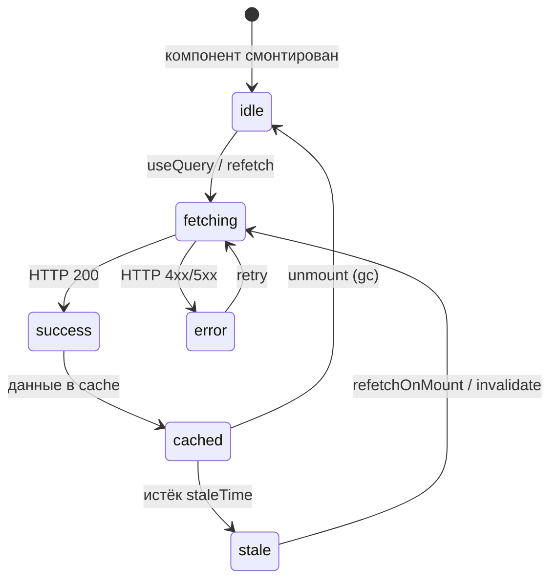

---

## Рисунок 3.10 — Валидация формы Vee-Validate и Zod (п. 3.9)

**Подпись:** Поток валидации данных формы: поля ввода, Zod-схема, отображение ошибок и формирование payload для API

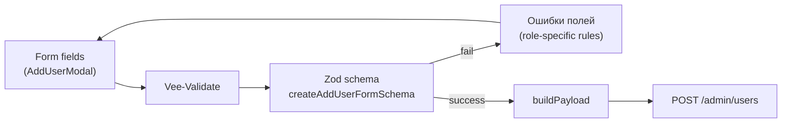

---

## Рисунок 3.11 — Unit-тестирование Vitest (п. 3.10)

**Подпись:** Структура unit-тестирования в проекте: Vitest, окружение happy-dom и colocated spec-файлы в слоях FSD

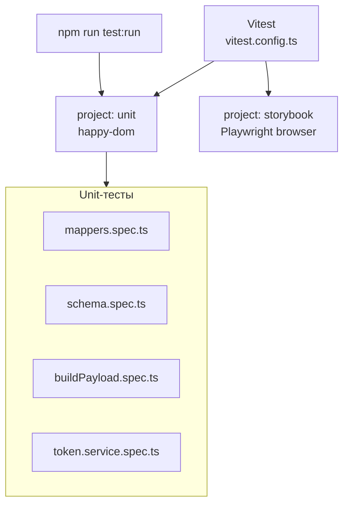

---

## Рисунок 3.12 — Storybook в процессе разработки UI (п. 3.11)

**Подпись:** Схема использования Storybook: изолированный рендер компонентов с провайдерами приложения и design tokens

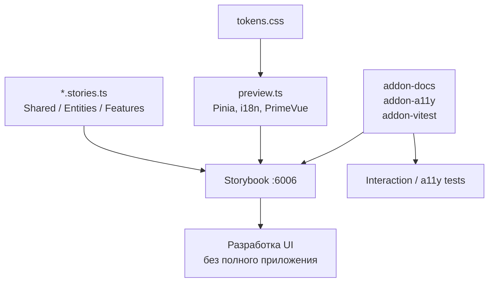

---

## Рисунок 3.13 — Контроль качества кода ESLint, Oxlint, Prettier (п. 3.12)

**Подпись:** Схема инструментов статического анализа и форматирования исходного кода frontend-приложения

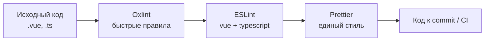

---

## Рисунок 3.14 — Git hooks Husky и lint-staged (п. 3.13)

**Подпись:** Схема цепочки контроля качества: изменение кода, pre-commit проверки lint-staged и pre-push unit-тесты Vitest

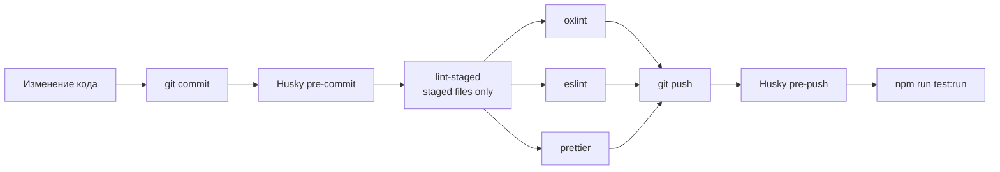

---

## Рисунок 3.15 — JSON Server в режиме разработки (п. 3.14)

**Подпись:** Схема взаимодействия в режиме разработки с JSON Server: Vue SPA, proxy Vite и файл db.json

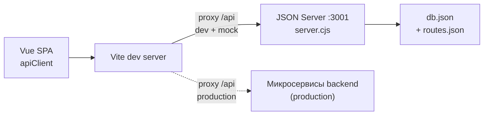

---

## Рисунок 3.16 — Multi-stage сборка Docker (п. 3.15)

**Подпись:** Схема multi-stage Dockerfile: этап сборки frontend на Node.js и этап раздачи статики через nginx

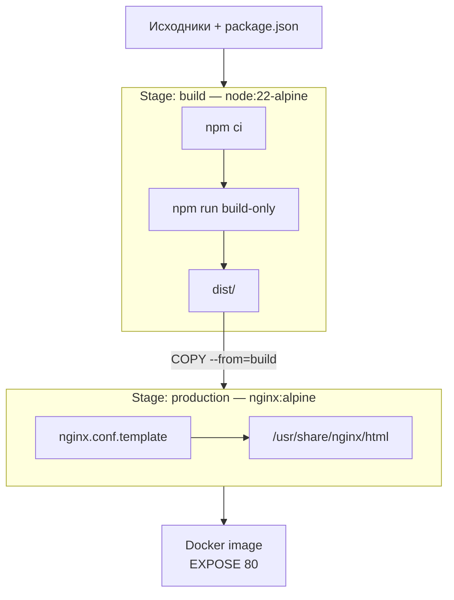

---

## Рисунок 3.17 — Production-развёртывание Docker и Nginx (п. 3.15)

**Подпись:** Схема production-развёртывания: браузер пользователя, контейнер nginx со статикой SPA и проксирование запросов `/api` на backend

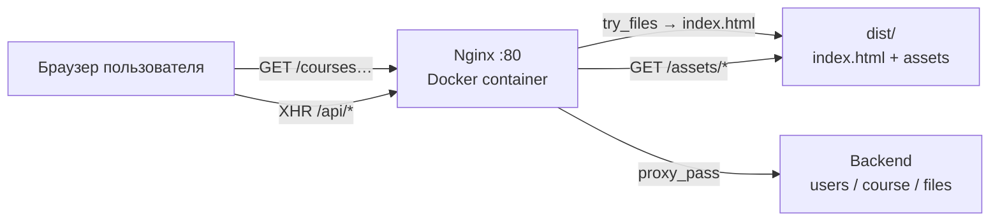

---

## Рисунок 3.18 — Сравнение frontend-фреймворков (введение, табл. 3.2)

**Подпись:** Схематичное сравнение рассмотренных frontend-фреймворков: Vue 3 выбран как баланс между полнотой экосистемы и сложностью интеграции для SPA учебной платформы

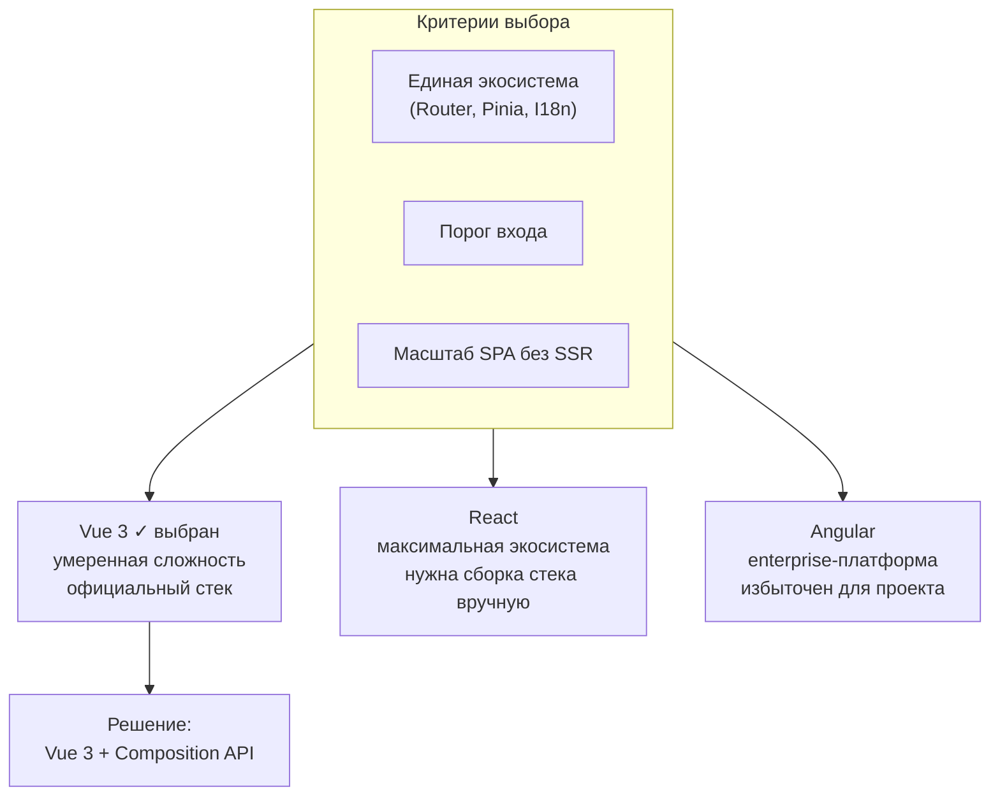

> Детальное сравнение — **таблица 3.2** в тексте главы.

---

## Сводная таблица рисунков

| Рисунок | Пункт главы                     | Тема                        |
| ------- | ------------------------------- | --------------------------- |
| 3.1     | 3.1 Vite                        | Pipeline сборки             |
| 3.2     | 3.2 Vue 3                       | Композиция UI               |
| 3.3     | 3.3 TypeScript                  | Поток типизации             |
| 3.4     | 3.4 / 3.8                       | Pinia vs Vue Query          |
| 3.5     | 3.5 Vue Router                  | Дерево маршрутов            |
| 3.6     | 3.5 Vue Router                  | Navigation guard            |
| 3.7     | 3.6 PrimeVue                    | Интеграция UI-kit           |
| 3.8     | 3.7 Vue I18n                    | Локализация                 |
| 3.9     | 3.8 TanStack Query              | Жизненный цикл query        |
| 3.10    | 3.9 Vee-Validate + Zod          | Валидация формы             |
| 3.11    | 3.10 Vitest                     | Unit-тесты                  |
| 3.12    | 3.11 Storybook                  | Изолированная разработка UI |
| 3.13    | 3.12 ESLint / Oxlint / Prettier | Lint и format               |
| 3.14    | 3.13 Husky                      | Git hooks                   |
| 3.15    | 3.14 JSON Server                | Mock API                    |
| 3.16    | 3.15 Docker                     | Multi-stage build           |
| 3.17    | 3.15 Docker + Nginx             | Production deploy           |
| 3.18    | Введение                        | Сравнение фреймворков       |
